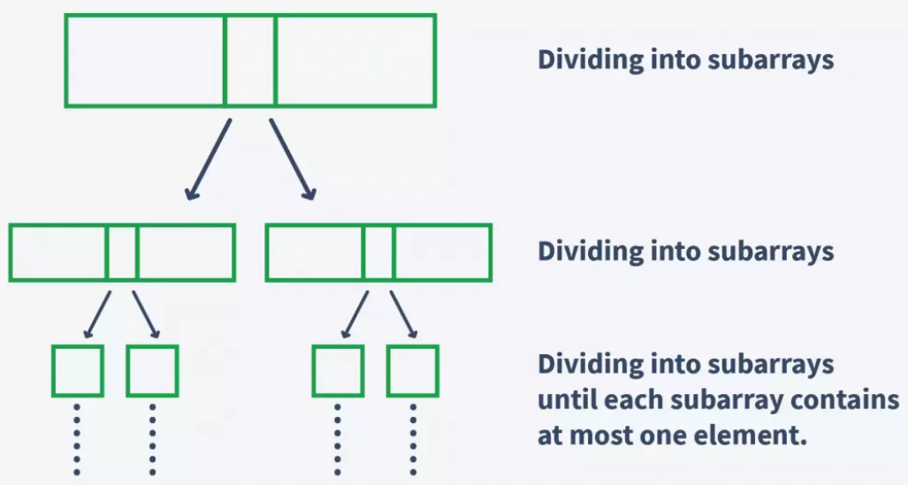
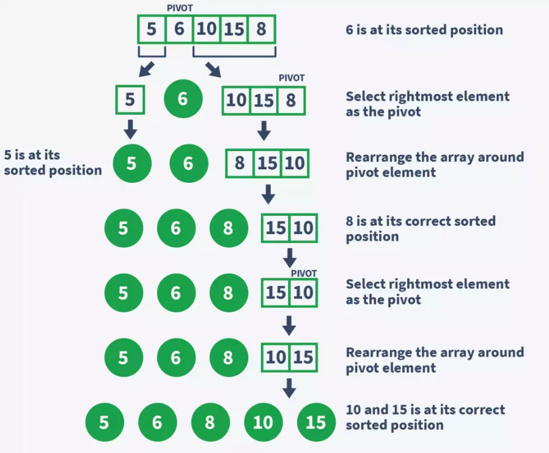

# Quick Sort
Quick sort, also known as **partition-exchange sort**, is an in-place sorting algorithm. It is a *divide and conquer* algorithm that works on the idea of selecting a pivot element and dividing the array into two subarrays around that pivot.

After selecting the pivot element, the array is split into two subarrays. One subarray contains the elements smaller than the pivot element, and the other subarray contains the elements greater than the pivot element.


At every iteration of quick sort, the chosen pivot element is placed at its correct position that is should acquire in the sorted array.

This process of selecting the pivot element and dividing the array into subarrays is carried out recursively until all the elements in the array are sorted.



In quick sort, every element arranges itself at its correct position to sort the given array. Here, the pivot element is placed at its correct sorted position, and hence it is the element that we know is definitely sorted. And thus, subarrays are divided around the pivot element.

**Point to Remember:** We can choose any element as our pivot, be it the first element, last element, or any random element from the array.

## How Does Quick Sort Algorithm Work?
1. Select the pivot element
2. Rearrange the elements of the array in a way that all the elements smaller than the pivot are on its left and that all the greater ones are on the right. They need not be sorted.
3. In this step, the sublist is divided into two parts – sublist before the pivot element, and sublist after the pivot element.
4. Repeat the above-given steps recursively until all the elements of the array are at their correct sorted position.

### Working of Quick Sort Algorithm


**Pseudocode** <br/>
1. Pseudocode for Partioning Subarrays <br/>
```java
function partition(array, low, high) 
    pivot = array[high]
    left = low
    right = high - 1

    while(left <= right)
        while(array[left] < pivot)
            left = left + 1
        end while

        while(array[right] > pivot)
            right = right - 1
        end while

        if(left < right)
            swap(array[left], array[right])
        end if
    end while
    swap(array[left], array[high])
    return left
end function
```

2. Pseudo code for Quick Sort Function
```java
quicksort(array, low, high) 
    if low < high
        pivot = partition(array, low, high)
        quicksort(array, low, pivot - 1)
        quicksort(array, pivot + 1, high)
    end if
end function
```

**Code** <br/>
```java
class QuickSort {
    public static int partition(int array[], int low, int high) {
        int pivot = array[high];
        int left = low;
        int right = high - 1;

        while (left <= right) {
            while(array[left] < pivot) {
                left++;
            }
            while(array[right] > pivot) {
                right--;
            }
            if(left < right) {
                int temp = array[left];
                array[left] = array[right];
                array[right] = temp;
            }
        }
        int temp = array[left];
        array[left] = array[high];
        array[high] = temp;

        return left;
    }

    public static void quickSort(int array[], int low, int high) {
        if(low < high) {
            int pivot = partition(array, low, high);
            quicksort(array, low, pivot - 1);
            quicksort(array, pivot + 1, high);
        }
    }
}
```

### Complexity Analysis
1. **Time Complexity**
    - **Worst Case:** O(n^2)
    - **Average Case:** Theta(nlog(n))
    - **Best Case:** Omega(nlog(n))
2. **Space Complexity**
    - **Worst Case:** O(n)
    - **Average Case:** O(logn)