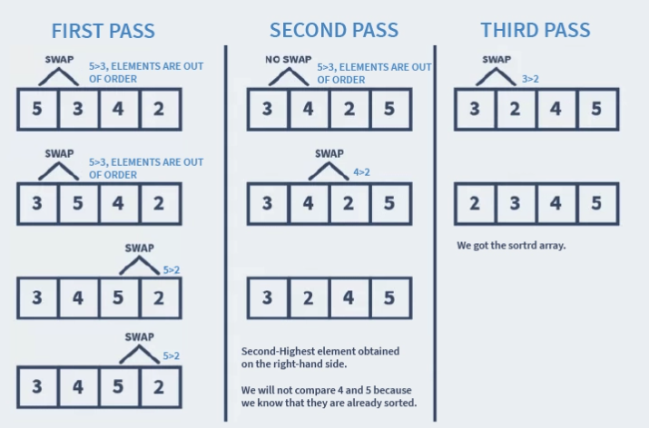

# Bubble Sort
Bubble Sort is the simplest algorithm. It works on the idea of repeatedly comparing the adjacent elements, from left to right, and swapping them if they are out of order.

In Bubble Sort, the repetition continues till the list we get the sorted list.

Since, it compares all the elements one by one, bubble sort is a slow algorithm and performs inefficiently in real-world scenarios.

Bubble Sort is also known as *Sinking Sort*.

### How does Bubble Sort work?
1. Start with the first element.
2. Compare the current element with the next element.
3. If the current element is greater than the next element, then swap both the elements. If not, move to the next element.
4. Repeat steps 1 – 3 until we get the sorted list. 



## Bubble Sort Algorithm

### Naive Method
To sort a list of n elements using bubble sort, we need to perform n – 1 iterations. And for each iteration, we need to:

1. Run a loop over the entire list or array.
2. Compare the element at the index i with the element at i + 1.
3. If the element at i is greater than the element at i + 1, swap both the elements
4. Else, move to the next element.

**Code** <br/>
```java
class Main {
    // function of bubble sort
    public static void bubbleSort(int arr[]) {
        int size = arr.length;

        for(int i = 0; i < size - 1; i++) {
            for(int j = 0; j < size - (i - 1); j++) {
                if(arr[j] > arr[j + 1]) {
                    int temp = arr[j];
                    arr[j] = arr[j + 1];
                    arr[j + 1] = temp;
                }
            }
        }
    }
}
```

### Optimized (Efficient Method)
Imagine the case where the list is already sorted. For example, our input list contains 2, 3, 4, 5 instead of 5, 3, 4, 2.

In the above algorithm, the loop would still run to compare all the elements. It might cause complexity issues like longer execution time.

To tackle this, we can do the following:
- Create a flag variable, called swapped.
- The value of swapped is set to true if, during any iteration, swapping was done.
- Else, the value of swapped is set to false.
- After an iteration, if the value of swapped is found to be false, it means the array is sorted, and no more comparisons are required.
- We then stop the execution.

**Code** <br/>
```java
class Main {
    // function of bubble sort
    public static void bubbleSort(int arr[]) {
        int size = arr.length;

        for(int = 0; i < (size - 1); i++) {
            boolean swapped = false;
            for(int j = 0; j < (size - i - 1); j++) {
                if(arr[j] > arr[j + 1]) {
                    int temp = arr[j];
                    arr[j] = arr[j + 1];
                    arr[j + 1] = temp;

                    swapped = true;
                }
            }
            if(!swapped)
                break;
        }
    }
}
```

### Complexity Analysis
1. **Time Complexity**
    - **Worst Case:** O(n^2) <br/>
        The worst-case occurs when we want to sort a list in ascending order, but it is arranged in descending order.
    - **Average Case:** Theta(n^2) <br/>
        The average case is when the list is arranged in a jumbled order.
    - **Best Case:** Omega(n) <br/>
        The best-case occurs when the list is already arranged in the desired order.

2. **Space Complexity**
    - **Naive Method:** O(1)
    - **Efficient Method:** O(2)