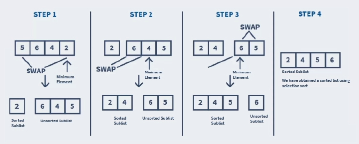

# Selection Sort
Selection sort, also known as in-place comparison sort, is a simple sorting algorithm. It works on the idea of repeatedly finding the smallest element and placing it at its correct sorted position.

Selection sort works by dividing the list into two sublists:
- Sorted Sublist: that is built on the left end of the list from left to right.
- Unsorted Sublist: that is the rest of the unsorted list, on the right end.

Initially, the sorted sublist is empty, and we only have the unsorted sublist.

With each iteration of the selection sort, we –
1. Search for the smallest element in the unsorted sublist.
2. Place it at the end of the sorted sublist.

### How does Selection Sort work?
Let us consider that we want to sort a list in ascending order. Here are the steps that the algorithm would follow:
1. Start with the first element. At this point, the entire list is unsorted. And the sorted sublist is empty.
2. Iterate over the list to search for the smallest element in it.
3. Swap the smallest element in the unsorted sublist with the element that is present at its correct sorted position.
4. Repeat the above steps until all the elements from the unsorted sublist are transferred to the sorted sublist.



## Selection Sort Algorithm
We know that to sort a list of n elements using Selection Sort, we need to perform n - 1 iterations.

1. Run a loop from i = 0 till the size of the list. Under the loop –
    - Declare a variable called minIndex. It helps in tracking the index of the next element that will be swapped with the element at the index i.
    - Run a nested for loop from j = i + 1 till the size of the list.
        - Check if the element at the index j is smaller than the element at the index mid_index. If it is, set minIndex equal to j. It helps us in searching for the smallest element in the unsorted sublist.
        - Swap the element at the index i with the element at index minIndex. It allows us to place the smallest element from the unsorted sublist at the end of the sorted sublist. Note that we are updating the value of minIndex each time we find an element smaller than it.

**Pseudocode** <br/>
```java
begin selectionSort(list)
    for i = 0 to sizeof(list) - 1
        minIndex = i;
        for j = i + 1 to sizeof(list)
            if list[j] < list[mid_index]
                minIndex = j
            end if
            swap(list[minIndex], list[i])
        end for
    end for
end selectionSort
```

**Code** <br/>
```java
class SelectionSort {
    public static void selectionSort(int arr[]) {
        int size = arr.length;
        for(int i = 0; i < size - 1; i++) {
            int minIndex = i;
            for(int j = i + 1; j < size; j++) {
                if(arr[j] < arr[minIndex])
                    minIndex = j;
                int temp = arr[minIndex];
                arr[minIndex] = arr[i];
                arr[i] = temp;
            }
        }
    }
}
```

### Complexity Analysis
1. **Time Complexity:**
    - **Worst Case:** O(n^2) <br/>
        The worst case occurs when we want to sort a list in ascending order, but it is arranged in descending order.

    - **Average Case:** Theta(n^2) <br/>
        The average case is when the list is arranged in a jumbled order.

    - **Best Case:**  Omeage(n) <br/>
        The best-case occurs when the list is already arranged in the desired order.

2. **Space Complexity:** O(1)