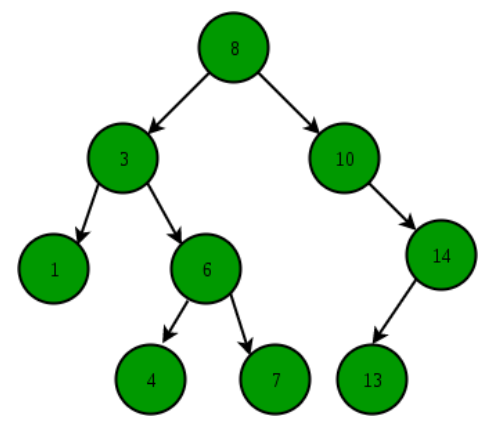

# Binary Search Tree Notes

**Binary Search Tree** is a node-based binary tree data structure which has the following properties:
- The left subtree of a node contains only nodes with keys lesser than the node's key.
- The right subtree of a node contains only nodes with keys greater than the node's key.
- The left and right subtree each must also be a binary search tree.

## Self Balancing Binary Search Tree
**Self-Balancing Binary Search Trees** are height-balanced binary search trees that automatically keeps height as small as possible when insertion and deletion operations are performed on tree. 

The height is typically maintained in order of Log n so that all operations take O(Log n) time on average. 

