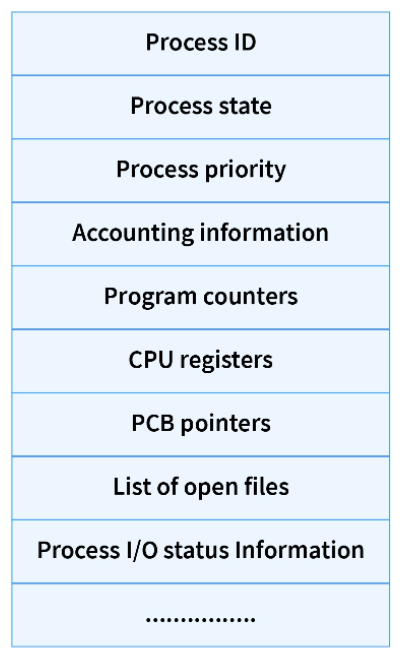
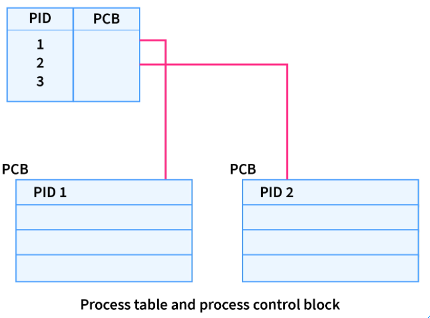
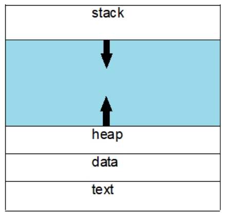

# Operating System Notes

## Introduction

An **Operating System** is a piece of software that manages all the resources of a computer system,
both hardware and software, and provides an environment in which the user can execute their programs in a convenient and efficient manner.

An Operating System:
- manages the computer hardware
- facilitates execution of application programs
- acts as an intermediary between the user and the computer hardware
- designed to be convenient and efficient

**Types of Operating System:**
- Single Process Operating System `MS DOS, 1981`
- Batch-Processing Operating System `ATLAS, Manchester, 1950s-1960s`
- Multiprogramming Operating System `THE, Dijkstra, early 1960s`
- Multitasking Operating System `CTSS, MIT, early 1960s`

## Process Concept

**Process vs Program**
| Process | Program |
| ------- | ------- |
| Process is an instance of an executing program. | Program contains a set of instructions designed to complete a specific task |
| Process is a active entity as it is created during execution and loaded into the main memory. | Program is a passive entity as it resides in the secondary memory. |
| Process exists for a limited span of time as it gets terminated after the completion of task. | Program exists at a single place and continues to exist until it is deleted. |
| Process has a high resource requirement, it needs resources like CPU, memory address, I/O during its lifetime. | Program does not have any resource requirement, it only requires memory space for storing the instructions. |
| Process has its own control block called Process Control Block. | Program does not have any control block. |

### Different States of a Process
States of a process are as following:  

- **New (Create):** In this step, the process is about to be created but not yet created, it is the program which is present in secondary memory that will be picked up by OS to create the process.

- **Ready:** New -> Ready to run. After the creation of a process, the process enters the ready state i.e. the process is loaded into the main memory.  
The process here is ready to run and is waiting to get the CPU time for its execution.  
Processes that are ready for execution by the CPU are maintained in a queue for ready processes.

- **Run:** The process is chosen by CPU for execution and the instructions within the process are executed by any one of the available CPU cores.

- **Blocked or Wait:** Whenever the process requests access to I/O or needs input from the user or needs access to a critical region it enters the blocked or wait state.  
The process continues to wait in the main memory and does not require CPU. Once the I/O operation is completed the process goes to the ready state.

- **Terminated or Completed:** Process is killed as well as PCB is deleted.

- **Suspend Ready:** Process that was initially in the ready state but were swapped out of main memory and placed onto external storage by scheduler are said to be in suspend ready state.  
The process will transition back to ready state whenever the process is again brought onto the main memory.

- **Suspend Wait or Suspend Blocked:** Similar to suspend ready but uses the process which was performing I/O operation and lack of main memory caused them to move to secondary memory.  
When work is finished it may go to suspend ready.

### Process Control Block (PCB)
When the process is created by the operating system it creates a data structure to store the information of that process. This is known as **Process Control Block**.

PCBs are stored in specifically reserved memory for the operating system known as **kernel space**.

*Roles of PCB:* It's the job of the OS to assign a CPU to a process as the process doesn't need a CPU all the time.

**Structure of PCB:**  

1. **Process ID:**  
    When a new process is created by the user, the OS assigns a unique ID i.e. a process ID to that process. This ID helps the process to be distinguished from other processed existing in the system.

2. **Process State:**  
    A process from it's creation to completion goes through different states. *Discussed above*

3. **Process Priority:**  
    Process priority is a numeric value that represents the priority of each process. The lesser the value, the greater the priority of that process.

4. **Process Accounting Information:**  
    This attribute gives the information of the resources used by that process in its lifetime. For example, CPU time connection time, etc.

5. **Program Counter:**  
    The program counter is a pointer that points to the next instruction in the program to be executed. This attribute of PCB contains the address of the next instruction to be executed in the process.

6. **CPU Registers:**  
    A CPU register is a quickly accessible small-sized location available to the CPU. These registers are also stored in the virtual memory (RAM).

7. **PCB Pointer:**  
    This field contains the address of the next PCB, which is in ready state.  
    This helps the OS to hierarchically maintain an easy control flow between parent processes and child processes.

8. **List of open files:**  
    It contains information on all the files that are used by that process. This field is important as it helps in OS to close all the opened files at the termination state of the process.

9. **Process I/O Information:**  
    In this field, the list of all the input/output devices which are required by that process during its execution is mentioned.

### How PCBs are stored?
PCBs are stored in the form of LinkedList in memory.

Operating System used Process Table to find the PCB present in memory.

**Process Table** is a table that contains *Process ID* and the reference to the corresponding PCB in memory.

### How does a process look like in memory?

- **Text:**  
    This section of memory contains the executable instructions of a program. It also contains constants, macros and it is read-only segment to prevent accidentally modification of an instruction. It is also sharable so that the so that another process can use this whenever it is required.

- **Data:**  
    Data Section segment of memory contains the global and static variables that are initialized by the programmer prior to the execution of a program. This segment is not read-only, as the value of the variables can be changed at the runtime.

- **Heap:**  
    To allocate memory for variables whose size cannot be statically determined by the compiler before program execution, requested by the programmer, there is a requirement of dynamic allocation of memory which is done in heap segment. It can be only determined at run-time. It is managed via system calls to malloc, calloc, free, delete etc.

- **Stack:**  
    A process generally also includes the process stack, which contains temporary data i.e. function parameters, return addresses, and local variables.

    This section is committed to store all the data needed by a function call in a program.

    A stack pointer register keeps the tracks of the top of the stack i.e., how much of the stack area using by the current process, and it is modified each time a value is “pushed” onto the stack. If the stack pointer meets the heap pointer the available free memory is depleted.    

### Difference between Process and Thread
| Process | Thread |
| ------- | ------ |
| Process means any program is in execution | Thread means a segment of a process |
| The process takes more time to terminate | The thread takes less time to terminate |
| It takes more time for creation | It takes less time for creation |
| It also takes more time for context switching | It takes less time for context switching |
| The process is less efficient in terms of communication | Thread is more efficient in terms of communication |
| The process is isolated | Threads share memory |
| If one process is blocked then it will not affect the execution of other processes | If a user-level thread is blocked, then all other user-level threads are blocked. |
| The process has its own Process Control Block, Stack and Address Space | Thread has parents' PCB, its own Thread Control Block, and Stack and common Address Space |

### Process Scheduling
The process scheduling is the activity of the process manager that handles the removal of the running process from the CPU and the selection of another process on the basis of a particular strategy.

### Types of Process Scheduling Queues:
1. **Job Queue**  
    This queue keeps all the processes in the system.

2. **Ready Queue**  
    This queue keeps a set of all processes residing in main memory, ready and waiting to execute. A new process is always put in this queue.

3. **Device Queue**  
    The processes which are blocked due to unavailability of an I/O device constitute this queue.

### Scheduler
Schedulers are special system software which handle process scheduling in various ways. Their main task is to select the jobs to be submitted into the system and to decide which process to run.

Schedulers are of three types:
| Long Term Scheduler | Short Term Scheduler | Mid Term Scheduler |
| ------------------- | -------------------- | ------------------ |
| It is a job scheduler | It is a CPU scheduler | It is a process swapping scheduler. |
| Speed is lesser than short term scheduler | Speed is fastest among other two | Speed is in between both short and long term scheduler. |
| It controls the degree of multiprogramming | It provides lesser control over degree of multiprogramming | It reduces the degree of multiprogramming. |
| It is almost absent or minimal in time sharing system | It is also minimal in time sharing system | It is a part of Time sharing systems. |
| It selects processes from pool and loads them into memory for execution | It selects those processes which are ready to execute | It can re-introduce the process into memory and execution can be continued. |

### CPU Bound Process vs I/O Bound Process
A program is CPU bound if it would go faster if the CPU were faster, i.e. it spends the majority of its time simply using the CPU (doing calculations). A program that computes new digits of π will typically be CPU-bound, it's just crunching numbers.

A program is I/O bound if it would go faster if the I/O subsystem was faster. Which exact I/O system is meant can vary; I typically associate it with disk, but of course networking or communication in general is common too. A program that looks through a huge file for some data might become I/O bound, since the bottleneck is then the reading of the data from disk.

### Context Switch
Context Switching involves storing the context or state of a process so that it can be reloaded when required and execution can be resumed from the same point as earlier. This is a feature of a multitasking operating system and allows a single CPU to be shared by multiple processes.

### What is a Context Switch?

## Process Synchronization

## Deadlocks

## Memory Management

## Virtual Memory Management

## Storage Management