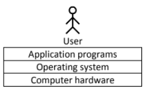
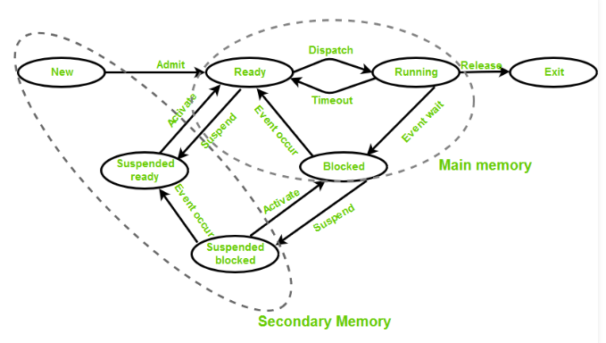

# Operating System Notes

## Introduction

An **Operating System** is a piece of software that manages all the resources of a computer system,
both hardware and software, and provides an environment in which the user can execute their programs in a convenient and efficient manner.

An Operating System:
- manages the computer hardware
- facilitates execution of application programs
- acts as an intermediary between the user and the computer hardware
- designed to be convenient and efficient

**Types of Operating System:**
- Single Process Operating System `MS DOS, 1981`
- Batch-Processing Operating System `ATLAS, Manchester, 1950s-1960s`
- Multiprogramming Operating System `THE, Dijkstra, early 1960s`
- Multitasking Operating System `CTSS, MIT, early 1960s`

## Process and Process Scheduling

**Process vs Program**
| Process | Program |
| ------- | ------- |
| Process is an instance of an executing program. | Program contains a set of instructions designed to complete a specific task |
| Process is a active entity as it is created during execution and loaded into the main memory. | Program is a passive entity as it resides in the secondary memory. |
| Process exists for a limited span of time as it gets terminated after the completion of task. | Program exists at a single place and continues to exist until it is deleted. |
| Process has a high resource requirement, it needs resources like CPU, memory address, I/O during its lifetime. | Program does not have any resource requirement, it only requires memory space for storing the instructions. |
| Process has its own control block called Process Control Block. | Program does not have any control block. |

### Different States of a Process
States of a process are as following:  

- **New (Create):** In this step, the process is about to be created but not yet created, it is the program which is present in secondary memory that will be picked up by OS to create the process.

- **Ready:** New -> Ready to run. After the creation of a process, the process enters the ready state i.e. the process is loaded into the main memory.  
The process here is ready to run and is waiting to get the CPU time for its execution.  
Processes that are ready for execution by the CPU are maintained in a queue for ready processes.

- **Run:** The process is chosen by CPU for execution and the instructions within the process are executed by any one of the available CPU cores.

- **Blocked or Wait:** Whenever the process requests access to I/O or needs input from the user or needs access to a critical region it enters the blocked or wait state.  
The process continues to wait in the main memory and does not require CPU. Once the I/O operation is completed the process goes to the ready state.

- **Terminated or Completed:** Process is killed as well as PCB is deleted.

- **Suspend Ready:** Process that was initially in the ready state but were swapped out of main memory and placed onto external storage by scheduler are said to be in suspend ready state.  
The process will transition back to ready state whenever the process is again brought onto the main memory.

- **Suspend Wait or Suspend Blocked:** Similar to suspend ready but uses the process which was performing I/O operation and lack of main memory caused them to move to secondary memory.  
When work is finished it may go to suspend ready.

### Process Control Block (PCB)

## Process Synchronization

## Deadlocks

## Memory Management

## Virtual Memory Management

## Storage Management