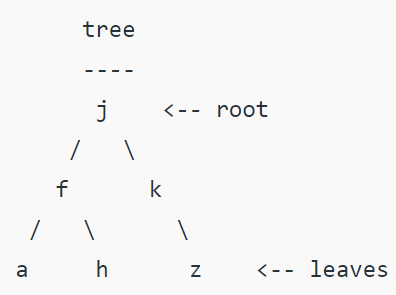
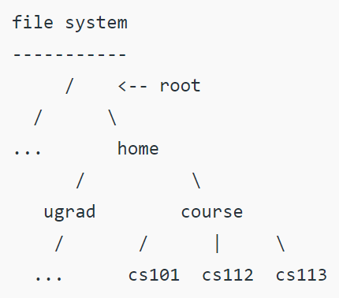
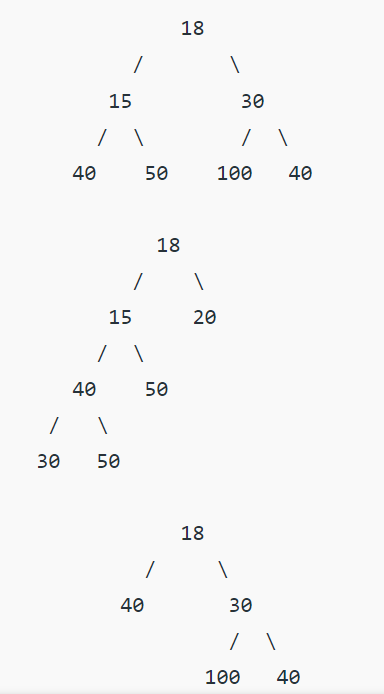
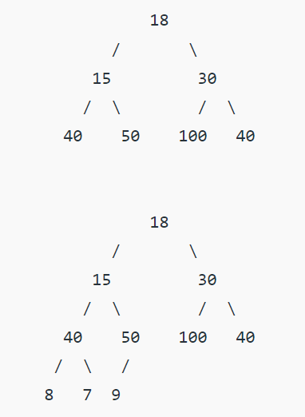
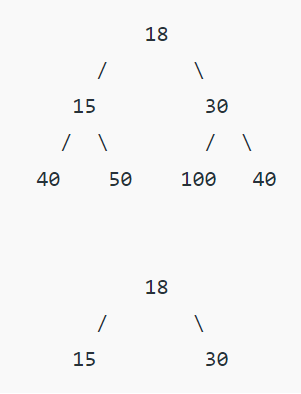
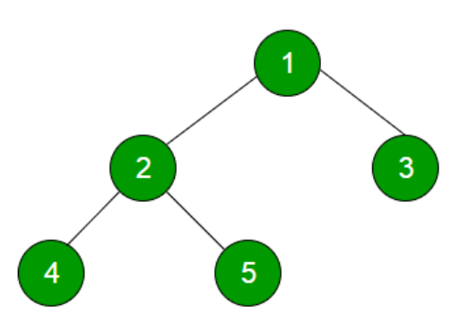

# Trees Notes

Tress are hierarchical, non-liner data structures.

- The topmost node is called **root** of the tree.
- The elements that are directly under an element are called its **children**.
- The element directly above something is called its **parent**.

### Why do we use Trees?
1. Trees are used might be because we want to store information that naturally forms a hierarchy.  
For ex: the file system of a computer. 

2. Trees (with some ordering e.g. BST) provides moderate access/search (quicker than Linked List and slower than arrays).

3. Trees provide moderate insertion/deletion (quicker than Arrays and slower than Undordered Linked Lists).

4. Like Linked Lists and unlike Arrays, Trees don't have an upper limit on number of nodes as nodes are linked using pointers.

### Applications of Trees:
1. Manipulate hierarchical data
2. If we organise keys in form of a tree (with BST), we can search for a given key in moderate time (quicker than Linked List and slower than Arrays)  
   Self-Balancing Search Trees like AVL and Red-Black trees gurantee an upper bound of O(Logn) for search.

3. We can insert/delete keys in moderate time (quicker than Arrays and slower than Unordered Linked Lists)  
   Self-Balancing Search Trees like AVL and Red-Black trees gurantee an upper bound of O(Logn) for insertion/deletion.

## Binary Tree
A tree whose elements have at most 2 children is called a *binary tree*.  
Since, each element in a binary tree can have only 2 children, we typically name them the left and the right child.

### Properties of Binary Tree
1. The maximum number of nodes at level 'l' of a binary tree is 2^l.

2. The maximum number of nodes in a binary tree of height 'h' is 2^h - 1.

3. In a Binary Tree with N nodes, minimum possible height or the minimum number of levels is Log2(N+1).

4. A Binary Tree with L leaves has atleast | Log2L | + 1 levels.

5. In Binary Tree where every node has 0 or 2 children, the number of leaf nodes is always one or more than nodes with two children.

## Types of Binary Tree
1. **Full Binary Tree**  
    A Binary Tree is a full binary tree if every node has 0 or 2 children.

   

2. **Complete Binary Tree**  
    A Binary Tree is a Complete Binary Tree if all the levels are completely filled except possibly in the last level and the last level has all keys as left as possible.

   

3. **Perfect Binary Tree**  
    A Binary Tree is a Perfect Binary Tree in which all the internal nodes have two children and all leaf nodes are at the same level.

   

   In a Perfect Binary Tree, the number of leaf nodes is the number of internal nodes plus 1

   L = I + 1  
   where L = number of leaf nodes  
   I = number of internal nodes

   A Perfect Binary Tree  of height h has 2^h+1 - 1 node.

4. **Balanced Binary Tree**  
    A Binary Tree is balanced if the height of the tree is O(logn) where n is the number of nodes.

5. **A degenerate (or pathological) tree**  
    A Tree where every internal node has one child. Such tress are performance-wise same as Linked List.

## Tree Traversals
A tree is typically traversed in two ways:
- Depth First Traversal (DFS)
- Breadth First Traversal (BFS)

**Depth First Traversals (DFS):**  
- Preorder (Root, Left, Right) : 1 2 4 5 3
- Inorder (Left, Root, Right) : 4 2 5 1 3
- Postorder (Left, Right, Root) : 4 5 2 3 1

**Breadth First Traversal (BFS)**  
Level Order Traversal of a tree is Breadth First Traversal for the tree.

BFS of above Tree: 1 2 3 4 5

### BFS vs DFS for Binary Tree
- **Is there any difference in terms of Time Complexity?**  
    All four traversals require O(n) time as they visit every node exactly once.

- **Is there any difference in terms of Extra Space?**  
    There is difference in terms of extra space required:
    1. Extra Space required for Level Order Traversal is O(w) where w is maximum width of Binary Tree.  
        In Level Order Traversal, queue one by one stores nodes of different level.
    2. Extra Space required for Depth First Traversals is O(h) where h is maximum height of Binary Tree.  
        In Depth First Traversals, function call stacks stores all ancestors of a node.

    **NOTE:** Extra space required for BFS is likely to be more when tree is more balanced and extra space for DFS is likely to be more when tree is less balanced.

- **How to Pick One?**  
    1. Extra Space can be one factor
    2. DFS are typically recursive and recursive code requires function call overheads.
    3. BFS start visiting nodes from root while DFS starts visiting nodes from leaves.  
       So, if our problem is to search something that is more likely to closer to root, we would prefer BFS, and if the target node is closed to a lead we would prefer DFS.
    

